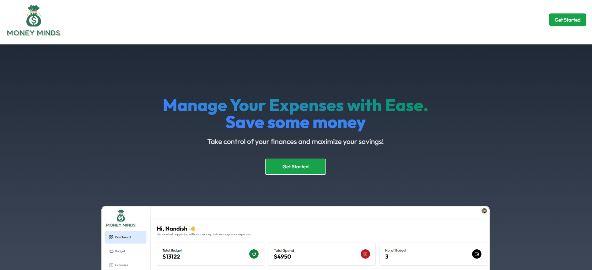
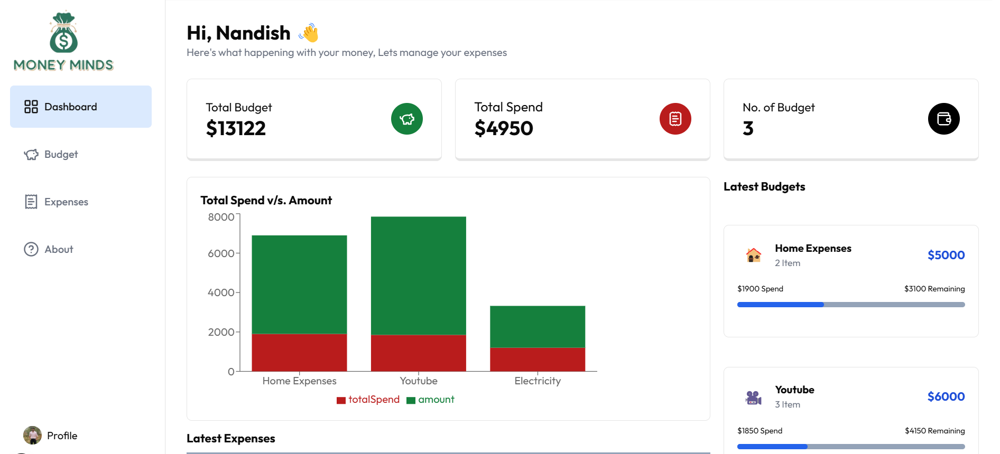
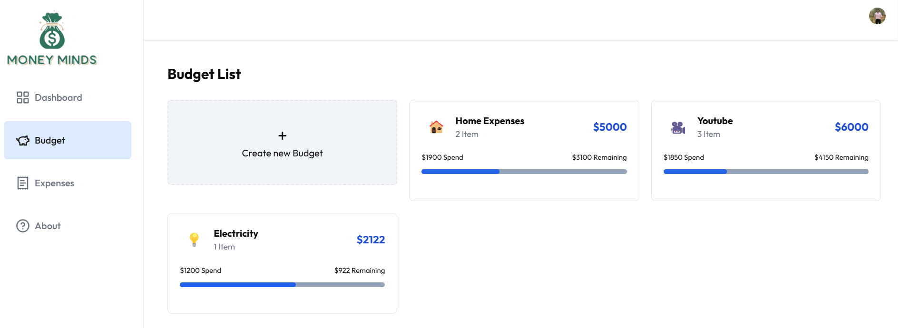
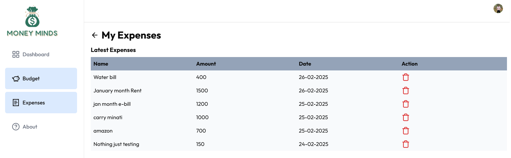
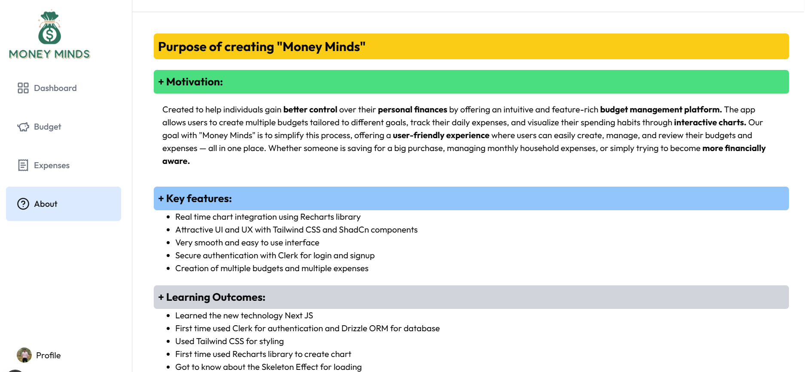
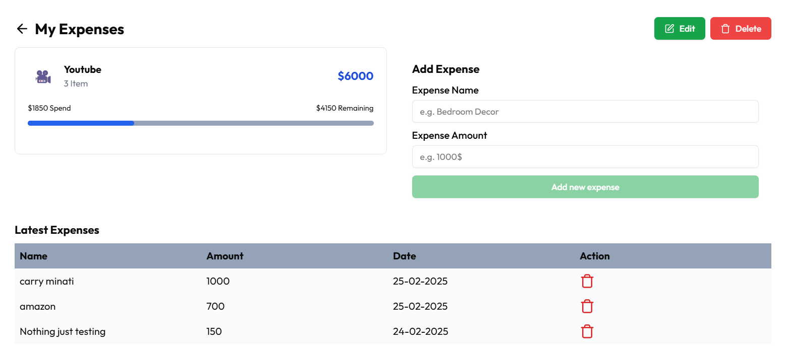
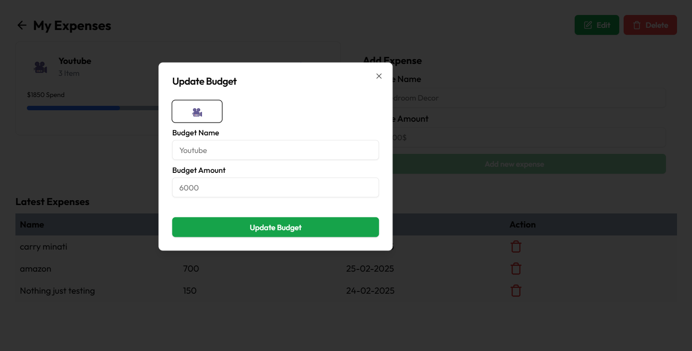

# Money Minds

The Money Minds project is designed to simplify the process of tracking expenses against budgets. With seamless user authentication via Clerk, users can securely log in and manage their personal financial data. The app allows users to create budgets for specific categories and track individual expenses within each budget.

The system provides real-time validation to ensure users do not exceed their allocated budgets, and offers intuitive feedback using toast notifications.

The backend is powered by Drizzle ORM, ensuring smooth and type-safe database interactions, while the frontend benefits from modern UI components for a clean and responsive user experience.


## Key Features

- Secure login and signup using Clerk
- Budget Creation
- Expense Tracking
- Budget Validation
- Responsive Design
- Modern Tech Stack like Next.js, Tailwind CSS, Drizzle ORM, Shadcn UI

## Project Photos

- Dashboard without Login
[](https://katherineoelsner.com/)

- Sign Up/Login page
[](https://katherineoelsner.com/)

- Dashboard after Login
[](https://katherineoelsner.com/)

- Budget page
[](https://katherineoelsner.com/)

- Expenses page
[](https://katherineoelsner.com/)

- About page
[](https://katherineoelsner.com/)

- Add Expenses page
[](https://katherineoelsner.com/)

- Update page
[](https://katherineoelsner.com/)

## Run Locally

Clone the project
```bash
  git clone https://github.com/NandishDPatel/Money-Minds.git
```

Go to the project directory
```bash
  cd Money-Minds
```

Install dependencies
```bash
  npm install
```

- After installing dependencies make sure to set your own clerk configuration by creating .env.local file inside the app directory. Like './app/.env.local' 
- Copy paste the below code in the .env.local file and set the first two variables from clerk website for secure login and authentication
```bash
  NEXT_PUBLIC_CLERK_PUBLISHABLE_KEY=
  NEXT_PUBLIC_DATABASE_URL=
  
  NEXT_PUBLIC_CLERK_SIGN_IN_URL=/sign-in
  NEXT_PUBLIC_CLERK_SIGN_UP_URL=/sign-up

  NEXT_PUBLIC_CLERK_SIGN_IN_FORCE_REDIRECT_URL=/dashboard
  NEXT_PUBLIC_CLERK_SIGN_UP_FORCE_REDIRECT_URL=/dashboard

```

- After setting up all the things now your project will be up and running by running the following command in your /Money-Minds directory your project will be up and running :)

```bash
  npm run dev
```
